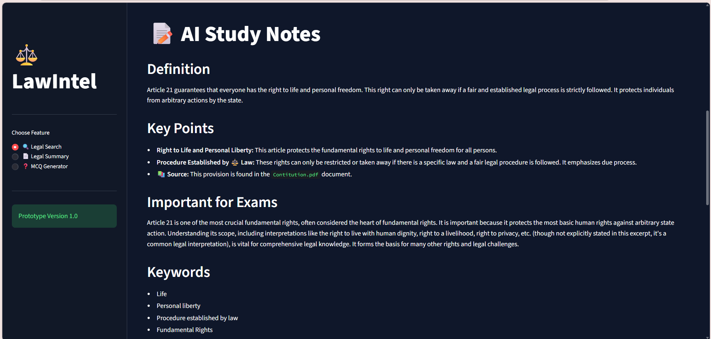
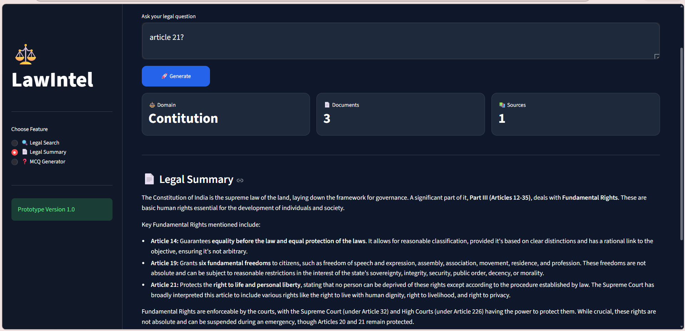
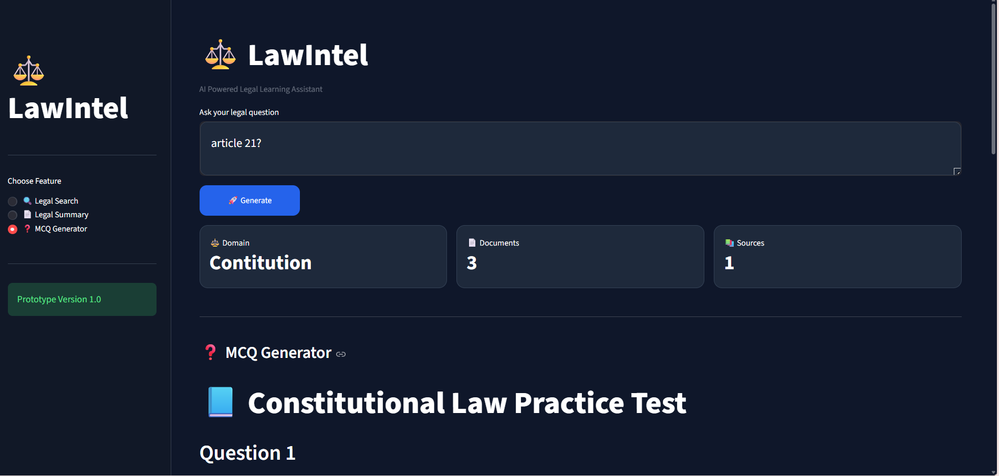

# ⚖️ LawIntel

> AI-Powered Legal Learning Assistant built using **Retrieval-Augmented Generation (RAG)**, **Google Gemini**, **FAISS**, **BM25**, and **Streamlit**.


---

## 📖 Overview

LawIntel is an AI-powered legal learning assistant that helps users explore Indian legal documents through intelligent retrieval and AI-generated responses.

Unlike a traditional chatbot, LawIntel uses a **Retrieval-Augmented Generation (RAG)** pipeline to retrieve relevant legal information before generating responses, improving accuracy and reducing hallucinations.

---

## ✨ Features

- 🔍 Legal Search
- 📄 Legal Summaries
- ❓ Practice MCQ Generator
- ⚖️ Constitution-aware Retrieval
- 📚 Source Citation
- 🚀 Hybrid Search (FAISS + BM25)
- 🤖 Google Gemini Integration

---

## 🏗 Architecture

```
                 User Query
                      │
                      ▼
            Knowledge Router
                      │
        ┌─────────────┴─────────────┐
        ▼                           ▼
     FAISS Search              BM25 Search
        │                           │
        └─────────────┬─────────────┘
                      ▼
                 Ranker
                      ▼
             Context Builder
                      ▼
              Google Gemini
                      ▼
               Final Response
```

---

## 📂 Project Structure

```
LawIntel/
│
├── app.py
├── create_vector.py
├── requirements.txt
├── README.md
├── LICENSE
│
├── data/
│   ├── Constitution.pdf
│   ├── ipc.pdf
│   ├── Articles_1.pdf
│
├── rag/
│   ├── chatbot.py
│   ├── retriever.py
│   ├── ranker.py
│   ├── context_builder.py
│   ├── mcq_generator.py
│   ├── knowledge_router.py
│   ├── embeddings.py
│   ├── pdf_loader.py
│   ├── response_formatter.py
│   └── text_splitter.py
│
└── vectorstore/
```

---

##  Tech Stack

- Python
- Streamlit
- LangChain
- Google Gemini
- FAISS
- BM25
- PyMuPDF
- Sentence Transformers

---

##  Installation

Clone the repository

```bash
git clone https://github.com/your-username/LawIntel.git
```

Move into the project

```bash
cd LawIntel
```

Install dependencies

```bash
pip install -r requirements.txt
```

Create a `.env` file

```env
GOOGLE_API_KEY=YOUR_API_KEY
```

Run the application

```bash
streamlit run app.py
```

---

##  Screenshots

### 🏠 Home Page

<p align="center">
  
</p>

---

### 🔍 Legal Search

<p align="center">
  
</p>

---

### 📄 Legal Summary

<p align="center">
  
</p>

---

### ❓ MCQ Generator

<p align="center">
  
</p>
---

## 🎯 Future Improvements

- Landmark Case Retrieval
- Bare Act Comparison
- Voice-based Legal Assistant
- Multi-language Support
- Case Law Summarization
- Legal Citation Export

---

## 👩‍💻 Author

**Shristi Chaturvedi**

B.Tech IT(AIAR) Student

Interested in AI, Retrieval-Augmented Generation, Legal AI, and Intelligent Information Retrieval.

---

## ⭐ If you found this project useful

Please consider giving it a ⭐ on GitHub.
